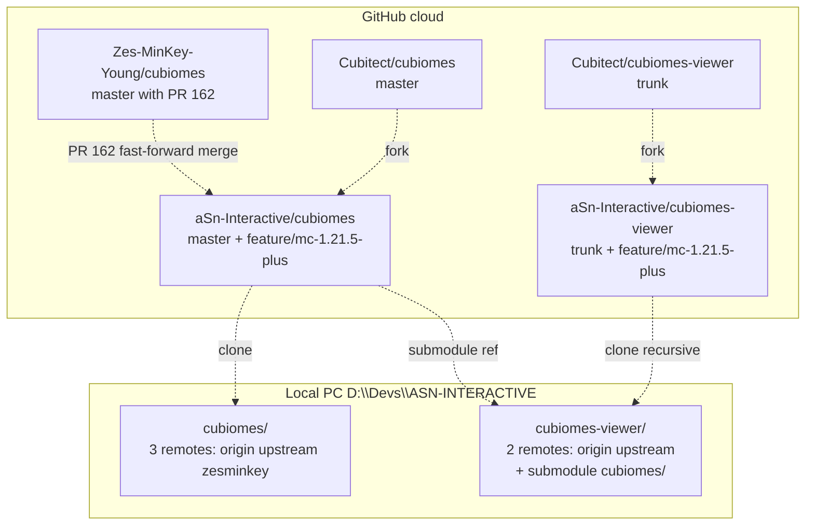

# BUILD.md — aSn-Interactive Fork (1.21.5+)

> Complement to the upstream [buildguide.md](buildguide.md). Read **this** file when
> working on the `aSn-Interactive` fork, because the fork uses Qt6 on MSYS2 UCRT64
> (the upstream guide is Qt5-centric) and carries additional patches and packaging
> caveats.

This document is the single source of truth for building, patching and distributing
the fork. It is deliberately verbose so that a future contributor (human or LLM)
can pick up the project cold and reproduce everything without guesswork.

---

## Table of contents

1. [Purpose & Context](#1-purpose--context)
2. [Repository architecture](#2-repository-architecture)
3. [Prerequisites](#3-prerequisites)
4. [Initial setup](#4-initial-setup)
5. [Upstream sync strategy](#5-upstream-sync-strategy)
6. [Code changes (what we patched and why)](#6-code-changes-what-we-patched-and-why)
7. [Build toolchain (MSYS2 UCRT64)](#7-build-toolchain-msys2-ucrt64)
8. [Compilation procedure](#8-compilation-procedure)
9. [Packaging for distribution](#9-packaging-for-distribution)
10. [Known pitfalls (lessons learned)](#10-known-pitfalls-lessons-learned)
11. [Adding 1.22 (or any future version)](#11-adding-122-or-any-future-version)
12. [Repo state cheat sheet](#12-repo-state-cheat-sheet)

---

## 1. Purpose & Context

### Why this fork exists

As of April 2026, `Cubitect/cubiomes-viewer` v4.1.2 (the latest release) only
officially supports Minecraft Java Edition up to **1.21 Winter Drop (1.21.4)**.
The upstream library `Cubitect/cubiomes` likewise stops there.

Minecraft 1.21.5 introduced a worldgen change — the **Pale Garden biome generates
more widely** (change from snapshot 25w02a). Without this change, seeds validated
in Cubiomes Viewer will not match what 1.21.5+ actually generates in-game.

Community contributor `Zes-MinKey-Young` opened [Cubiomes PR #162](https://github.com/Cubitect/cubiomes/pull/162)
adding support for 1.21.5 through 1.21.11. At the time this fork was created, the
PR was open and reviewed but not merged. This fork builds on top of that PR and
extends it for viewer-side usability.

### Scope

- **Target**: personal / internal use, not intended as an upstream contribution.
- **Supported MC versions**: `1.21.5`, `1.21.6` (Chase the Skies), `1.21.7`, up to `1.21.11`, plus the year-based `26.1` (Tiny Takeover), `26.1.1`, `26.1.2`.
- **Platform**: Windows 10/11 x64 built via MSYS2 UCRT64.
- **UI language**: English (translations for other languages disabled in our build to keep the package small).

### What the fork does NOT do

- No contribution back to upstream (no PR opened).
- No support for Bedrock edition.
- No automatic CI / releases. Everything is manual.
- No new biomes or structures beyond Pale Garden; Mojang didn't add any between 1.21.5 and 1.21.11.

### Worldgen reality between 1.21.4 and 1.21.11

| Version | Worldgen change        | Notes                                      |
| ------- | ---------------------- | ------------------------------------------ |
| 1.21.4  | Pale Garden added      | Narrow noise range, rare generation.       |
| 1.21.5  | Pale Garden widened    | Larger areas, more spawns. Only real delta.|
| 1.21.6  | None                   | "Chase the Skies": happy ghasts, clouds, cosmetic. |
| 1.21.7  | None                   | Bug fixes.                                 |
| 1.21.8–1.21.11 | None           | Hotfixes; a seed from 1.21.5 matches 1.21.11 byte-for-byte.|
| 26.1 (Tiny Takeover) | None     | Golden dandelion, baby mob models, datapack feature-config reshuffle. No biome/structure/noise change. |
| 26.1.1 / 26.1.2 | None          | Chat-report fix / critical hotfixes. Worldgen identical to 1.21.5+.|

Consequence: a seed validated in 1.21.5 is **identical** in 1.21.11 at the
worldgen level. The fork exposes multiple version entries only because players
mentally pick "the version they play", not "the worldgen engine".

### Upstream references

- `Cubitect/cubiomes` → [github.com/Cubitect/cubiomes](https://github.com/Cubitect/cubiomes)
- `Cubitect/cubiomes-viewer` → [github.com/Cubitect/cubiomes-viewer](https://github.com/Cubitect/cubiomes-viewer)
- `Zes-MinKey-Young/cubiomes` (PR #162 branch) → [github.com/Zes-MinKey-Young/cubiomes](https://github.com/Zes-MinKey-Young/cubiomes)
- Our forks live under [github.com/aSn-Interactive](https://github.com/aSn-Interactive).

---

## 2. Repository architecture

Two independent GitHub forks, linked via a git submodule, each with their own
feature branch.



### Local paths (canonical)

| Local path                                      | GitHub repo                          | Active branch              |
| ----------------------------------------------- | ------------------------------------ | -------------------------- |
| `D:\Devs\ASN-INTERACTIVE\cubiomes\`             | `aSn-Interactive/cubiomes`           | `feature/mc-1.21.5-plus`   |
| `D:\Devs\ASN-INTERACTIVE\cubiomes-viewer\`      | `aSn-Interactive/cubiomes-viewer`    | `feature/mc-1.21.5-plus`   |
| `D:\Devs\ASN-INTERACTIVE\cubiomes-viewer\cubiomes\` | *(submodule)* → `aSn-Interactive/cubiomes` | `feature/mc-1.21.5-plus` |

Both directories exist as **independent clones on disk**. The `cubiomes` folder
inside `cubiomes-viewer` is a git submodule that shares the same GitHub repo as
the standalone clone, but has its own `.git/` metadata and can be on a different
commit.

### Remotes per repo

**`D:\Devs\ASN-INTERACTIVE\cubiomes\`**

| Remote name | URL                                                  | Purpose                              |
| ----------- | ---------------------------------------------------- | ------------------------------------ |
| `origin`    | `https://github.com/aSn-Interactive/cubiomes.git`    | Our fork, push target.               |
| `upstream`  | `https://github.com/Cubitect/cubiomes.git`           | Upstream, to pull future releases.   |
| `zesminkey` | `https://github.com/Zes-MinKey-Young/cubiomes.git`   | Source of PR #162 commits.           |

**`D:\Devs\ASN-INTERACTIVE\cubiomes-viewer\`**

| Remote name | URL                                                       | Purpose                            |
| ----------- | --------------------------------------------------------- | ---------------------------------- |
| `origin`    | `https://github.com/aSn-Interactive/cubiomes-viewer.git`  | Our fork, push target.             |
| `upstream`  | `https://github.com/Cubitect/cubiomes-viewer.git`         | Upstream, to pull future releases. |

### Branch structure

- `cubiomes` fork:
  - `master` → mirrors upstream. Never commit here directly.
  - `feature/mc-1.21.5-plus` → 9 commits ahead of upstream master (8 from PR #162 via fast-forward + 1 of our own).
- `cubiomes-viewer` fork:
  - `trunk` → mirrors upstream. Note: upstream default branch is `trunk`, NOT `master`.
  - `feature/mc-1.21.5-plus` → 3 commits ahead of upstream trunk (submodule repoint + UI patches + this BUILD.md).

---

## 3. Prerequisites

- **OS**: Windows 10 version 2004+ or Windows 11, x64.
- **Disk**: ~5 GB free (MSYS2 install + Qt6 + build artifacts + 80 MB distributable).
- **Git client**: GitHub Desktop recommended for newbies; CLI (`git.exe`) works too.
- **GitHub account**: required to fork the two upstream repos.
- **MSYS2**: latest installer from [msys2.org](https://www.msys2.org/). **Do not** use WSL, Cygwin, or native Visual Studio — the build system assumes MinGW-style GCC.

No Qt installer, no Visual Studio, no Cygwin. MSYS2 provides everything.

---

## 4. Initial setup

### 4.1 Fork on GitHub

1. Log into GitHub.
2. Open `https://github.com/Cubitect/cubiomes` → click **Fork** (top right) → keep name `cubiomes`, **uncheck** "Copy the main branch only" → **Create fork**.
3. Repeat for `https://github.com/Cubitect/cubiomes-viewer`.

You now have `aSn-Interactive/cubiomes` and `aSn-Interactive/cubiomes-viewer` on GitHub.

### 4.2 Clone locally (GitHub Desktop path)

For each repo: **File → Clone repository → URL tab** → paste GitHub URL → set local path to `D:\Devs\ASN-INTERACTIVE\<reponame>` → **Clone**.

When prompted *"How are you planning to use this fork?"*, choose:

- **"To contribute to the parent project"** → sets `upstream` remote automatically. Recommended.
- **"For my own purposes"** → no `upstream` remote (you'd have to add it manually later).

Either works; our config ended up with `upstream` set on both, so pick the first.

### 4.3 Verify the submodule

**Critical step**: GitHub Desktop does not always recurse into submodules on clone.

After cloning `cubiomes-viewer`, open `D:\Devs\ASN-INTERACTIVE\cubiomes-viewer\cubiomes\`
in Windows Explorer:

- If the folder contains `biomes.h`, `finders.c`, `CMakeLists.txt`, `tables/` etc → **OK, nothing to do**.
- If the folder is **empty** or only contains a `.git` file → run this in PowerShell (Repository → Open in PowerShell from GitHub Desktop):
  ```bash
  git submodule update --init --recursive
  ```

### 4.4 Create the feature branch on each fork

In GitHub Desktop, for each repo:

1. Switch to that repo (top-left dropdown).
2. Click **Current branch** → **New Branch**.
3. Name: `feature/mc-1.21.5-plus`.
4. Base: `master` for `cubiomes`, **`trunk`** for `cubiomes-viewer` (not `master`, upstream default is `trunk`).
5. **Create Branch**.
6. Click **Publish branch** so the branch exists on GitHub.

---

## 5. Upstream sync strategy

The fork has three parents that may all emit new commits:
- `upstream` (Cubitect) → official releases and fixes.
- `zesminkey` (only on `cubiomes` repo) → PR #162 updates.
- Our own `origin` → our custom patches.

### 5.1 One-time — add the `zesminkey` remote to cubiomes

GitHub Desktop cannot add custom remotes. Do this via PowerShell (Repository →
Open in PowerShell **while the cubiomes repo is selected**):

```powershell
git remote add zesminkey https://github.com/Zes-MinKey-Young/cubiomes.git
git fetch zesminkey
```

### 5.2 Initial fast-forward merge of PR #162

When our `feature/mc-1.21.5-plus` branch is freshly created from `master`, it is
at the same commit as upstream. `zesminkey/master` sits directly on top of
upstream master with only 8 PR #162 commits on top, so:

```powershell
git checkout feature/mc-1.21.5-plus
git merge zesminkey/master
```

Expected output: `Updating e61f905..ca9fcb4 / Fast-forward`. If you see "Merge made
by the 'ort' strategy" instead, the ancestry diverged — investigate before
continuing.

### 5.3 Pulling future upstream changes

When Cubitect ships a new upstream release:

```powershell
# On cubiomes fork
cd D:\Devs\ASN-INTERACTIVE\cubiomes
git checkout master
git pull upstream master
git push origin master
git checkout feature/mc-1.21.5-plus
git merge master   # or rebase, depending on taste
# Resolve conflicts if any, push.

# On cubiomes-viewer fork
cd D:\Devs\ASN-INTERACTIVE\cubiomes-viewer
git checkout trunk
git pull upstream trunk
git push origin trunk
git checkout feature/mc-1.21.5-plus
git merge trunk
```

If the `cubiomes` submodule pointer needs updating in the viewer after a cubiomes
bump, `cd cubiomes && git pull && cd .. && git add cubiomes && git commit`.

---

## 6. Code changes (what we patched and why)

### 6.1 Cubiomes library side — commit `c9bfda7`

**File**: [cubiomes/biomes.h](cubiomes/biomes.h), lines 35-44.

We replaced zesminkey's single alias (`MC_1_21_11 = MC_1_21_5`) with **distinct
enum values** so the viewer dropdown can expose each patch version separately.
Worldgen gating still works because existing version checks use `>=` comparisons
against `MC_1_21_5` / `MC_1_21_WD`, never `==` against intermediate versions.

```c
MC_1_21_1,
MC_1_21_3,
MC_1_21_WD, MC_1_21_4 = MC_1_21_WD,  // alias kept for backwards compat
MC_1_21_5,
MC_1_21_6,
MC_1_21_7,
MC_1_21_8,
MC_1_21_9,
MC_1_21_10,
MC_1_21_11,
MC_1_21 = MC_1_21_11,
MC_NEWEST = MC_1_21,
```

**File**: [cubiomes/util.c](cubiomes/util.c).

- `mc2str()` switch: added one `case` per version. Also **renamed the display
  label** of `MC_1_21_WD` from `"1.21 WD"` to `"1.21.4"` (its final release name).
- `str2mc()` chain: added `if (!strcmp(s, "1.21.X")) return MC_1_21_X;` for every
  new version. The legacy `"1.21 WD"` string is still recognised for backwards
  compatibility with old saved sessions.

### 6.2 Viewer side — commits `42f65bb` and `8316c04`

**File**: [.gitmodules](.gitmodules).

```ini
[submodule "cubiomes"]
    path = cubiomes
    url = https://github.com/aSn-Interactive/cubiomes.git
    branch = feature/mc-1.21.5-plus
```

After editing, run once:

```bash
git submodule sync
git -C cubiomes remote set-url origin https://github.com/aSn-Interactive/cubiomes.git
git -C cubiomes fetch origin
git -C cubiomes checkout feature/mc-1.21.5-plus
```

Then `git add .gitmodules cubiomes && git commit` to lock the submodule pointer.

**File**: [src/mainwindow.cpp](src/mainwindow.cpp), around line 699.

The loop `for (int mc = MC_NEWEST; mc > MC_UNDEF; mc--)` builds the version
dropdown automatically via `mc2str(mc)`. No code change needed for the dropdown
itself; the new versions appear for free.

However we **extended the "experimental" filter** to hide the intermediate
`1.21.5`, `1.21.6`, `1.21.8`, `1.21.9`, `1.21.10` behind the experimental toggle,
because worldgen is identical among them so showing 7 identical entries is noisy.
`1.21.7` (Chase the Skies, popular) and `1.21.11` (latest) stay visible by default:

```cpp
if (mc <= MC_1_0 || mc == MC_1_16_1 || mc == MC_1_19_2 || mc == MC_1_21_1 || mc == MC_1_21_WD ||
    mc == MC_1_21_5 || mc == MC_1_21_6 || mc == MC_1_21_8 || mc == MC_1_21_9 || mc == MC_1_21_10)
    continue;
```

**File**: [src/config.h](src/config.h), line 18.

```cpp
enum { MC_DEFAULT = MC_1_21 };  // was MC_1_21_3
```

Fresh users start on the newest version by default.

**File**: [src/util.cpp](src/util.cpp), around line 159.

Just a comment fix:

```cpp
// 1.21.4 (Winter Drop)    // was: 1.21.3 (Winter Drop Version TBA)
case pale_garden: return QApplication::translate("Biome", "Pale Garden");
```

### 6.2bis Year-based versioning 26.x (May 2026)

Mojang switched to a `year.drop.patch` scheme in 2026: `26.1` (Tiny Takeover,
released 2026-03-24) is the first game drop of 2026, `26.1.1` and `26.1.2` are
its hotfixes. We verified the full changelogs: 26.1's "World Generation" section
only reshuffles **datapack feature configuration** (flower/random_patch feature
types removed, `trapezoid` Int Provider, `rule_based_state_provider`, tree config),
renames `generate_features` → `generate_structures`, and moves save folders. None
of it touches the biome climate tree, structure placement/salts, or noise that
cubiomes emulates. **Worldgen is still frozen at the 1.21.5+ state (`btree215`).**

So we exposed 26.x exactly like the 1.21.x patches — pure labels, no new btree:

- `cubiomes/biomes.h`: added distinct enum values `MC_26_1`, `MC_26_1_1`,
  `MC_26_1_2` after `MC_1_21`, and moved `MC_NEWEST = MC_26_1_2`. The btree
  selector `if (mc >= MC_1_21_5)` in `biomenoise.c` keeps working because the new
  values are greater than `MC_1_21_5`.
- `cubiomes/util.c`: `mc2str()` cases `"26.1"`, `"26.1.1"`, `"26.1.2"` and the
  matching `str2mc()` entries.
- `cubiomes-viewer/src/config.h`: `MC_DEFAULT = MC_26_1` (fresh users land on the
  current game drop).
- `cubiomes-viewer/src/mainwindow.cpp`: hid `MC_26_1_1` behind the experimental
  toggle (identical worldgen); `26.1` and `26.1.2` stay visible by default.

We kept the `MC_1_21_*` family rather than renaming everything to the year format,
to stay close to upstream and avoid touching every `>=` version gate.

### 6.3 Files to revisit after a major upstream update

When pulling a new upstream release, these are the exact files to check for
conflicts or manual re-patching:

- `cubiomes/biomes.h` — enum list.
- `cubiomes/util.c` — mc2str / str2mc.
- `cubiomes/finders.c` — version-gated biome parameter tables (lines ~5505–5530).
- `cubiomes/biomenoise.c` — btree table selection by version (lines ~1465–1475).
- `cubiomes-viewer/src/mainwindow.cpp` — experimental filter list.
- `cubiomes-viewer/src/config.h` — `MC_DEFAULT`.
- `cubiomes-viewer/.gitmodules` — submodule URL & branch.

---

## 7. Build toolchain (MSYS2 UCRT64)

The upstream [buildguide.md](buildguide.md) recommends the official Qt Installer
with MinGW bundled. We use **MSYS2 UCRT64** instead because it's smaller, faster
to install, and doesn't require a Qt account.

### 7.1 Install MSYS2

1. Download the installer from [msys2.org](https://www.msys2.org/) (~120 MB).
2. Run installer. Accept default install path `C:\msys64` (changing it causes path issues down the road).
3. Finish install, let it launch a shell.

### 7.2 First system update

In the MSYS2 shell that opened (prompt starts with `MSYS` in purple), run:

```bash
pacman -Syu
```

Answer `Y` to prompts. If it asks you to close and reopen the shell, do so.

### 7.3 Switch to UCRT64 shell

**This is critical**. MSYS2 provides multiple shells:

| Shell        | Prompt color | Target environment                  |
| ------------ | ------------ | ----------------------------------- |
| MSYS         | Purple       | Generic Unix layer. Don't compile here. |
| MINGW64      | Magenta      | Older MSVCRT runtime. **Do not use**. |
| **UCRT64**   | **Magenta**  | **Modern UCRT runtime. Use this.** |
| CLANG64      | Yellow       | Clang-based, alternative.           |
| CLANGARM64   | Red          | ARM64, irrelevant on x64 Windows.   |

Close the MSYS shell. From the Start menu, launch **"MSYS2 UCRT64"** specifically.
The prompt must display `UCRT64` in its color. If it doesn't, you're in the
wrong shell.

### 7.4 Install the toolchain

```bash
pacman -S --needed mingw-w64-ucrt-x86_64-qt6-base \
                   mingw-w64-ucrt-x86_64-qt6-tools \
                   mingw-w64-ucrt-x86_64-cmake \
                   mingw-w64-ucrt-x86_64-ninja \
                   mingw-w64-ucrt-x86_64-gcc \
                   mingw-w64-ucrt-x86_64-pkgconf \
                   mingw-w64-ucrt-x86_64-make
```

Note the `-ucrt-x86_64-` prefix. Using `-x86_64-` instead (without `ucrt`) would
install MINGW64 packages that are incompatible with the UCRT64 shell.

~1.5 GB download, 5-10 minutes. Answer `Y` to confirm.

### 7.5 Verify

```bash
cmake --version       # expect 4.x
qmake6 --version      # expect "Using Qt version 6.x.x"
g++ --version         # expect g++ (Rev..., Built by MSYS2 project) 15.x or later
ninja --version       # expect 1.13.x
mingw32-make --version # expect GNU Make 4.x, Built for x86_64-w64-mingw32
```

All five commands must succeed. If `mingw32-make` is missing, re-run the
`pacman -S ...` line — the `-make` package is easy to forget.

### 7.6 Note on build systems

- **Viewer** uses `qmake` (`cubiomes-viewer.pro`). CMake is installed but not used here.
- **Cubiomes library** ships both `CMakeLists.txt` and a `makefile`. When built as
  a submodule from the viewer, qmake invokes `make -C cubiomes -f makefile` via
  `QMAKE_PRE_LINK`. Standalone you could use either.

---

## 8. Compilation procedure

All commands run in the **UCRT64** shell.

### 8.1 Out-of-tree build (recommended)

```bash
cd /d/Devs/ASN-INTERACTIVE/cubiomes-viewer
alias make=mingw32-make   # so generic 'make' invocations work in this session
mkdir -p build
cd build
qmake6 ../cubiomes-viewer.pro
make -j$(nproc)
```

### 8.2 Expected timing

- `qmake6` step: 2-3 seconds. Produces `Makefile`, `Makefile.Release`, `Makefile.Debug`, `.qmake.stash` plus `ui_*.h` generated from `.ui` files.
- `make -j$(nproc)` step: 5-15 minutes on first build, depending on CPU core count. It compiles:
  - Bundled Lua sources (~34 C files)
  - Cubiomes library as static archive (`libcubiomes.a`)
  - libwinsane helper (Windows UTF-16 boilerplate)
  - Viewer C++ code + Qt moc/uic/rcc generated files (~30 compilation units)

### 8.3 Output

The binary lands at:

```
D:\Devs\ASN-INTERACTIVE\cubiomes-viewer\build\release\cubiomes-viewer.exe
```

~3.5 MB. It is **not yet portable** — it requires DLLs from `C:\msys64\ucrt64\bin\`
to be in PATH. If you launch it from the UCRT64 shell it works, but double-clicking
from Explorer will produce "DLL not found" popups. See section 9.

### 8.4 Rebuilding after source changes

```bash
cd /d/Devs/ASN-INTERACTIVE/cubiomes-viewer/build
make -j$(nproc)           # incremental
# or, to rebuild from scratch:
make clean
make -j$(nproc)
```

If you edited the `.pro` file or changed submodule commits, re-run `qmake6 ..`
before `make`.

---

## 9. Packaging for distribution

Goal: produce a self-contained folder (or ZIP) launchable by double-click on any
Windows 10/11 x64 machine **without** MSYS2 installed.

Final footprint: ~80 MB, ~40 files including Qt DLLs, plugins, and MinGW runtime.

### 9.1 Prepare distribution folder

From PowerShell (or any Windows shell — these are file operations):

```powershell
$src = "D:\Devs\ASN-INTERACTIVE\cubiomes-viewer\build\release\cubiomes-viewer.exe"
$dst = "D:\Devs\ASN-INTERACTIVE\cubiomes-viewer\dist\CubiomesViewer-1.21.5-plus"
New-Item -Path $dst -ItemType Directory -Force | Out-Null
Copy-Item $src -Destination $dst -Force
```

### 9.2 Qt deps via windeployqt6

From the UCRT64 shell (or from PowerShell with the UCRT64 bin prepended to PATH):

```powershell
$env:PATH = "C:\msys64\ucrt64\bin;" + $env:PATH
cd D:\Devs\ASN-INTERACTIVE\cubiomes-viewer\dist\CubiomesViewer-1.21.5-plus
windeployqt6 --release --compiler-runtime --no-opengl-sw --no-system-d3d-compiler --no-quick-import --no-translations cubiomes-viewer.exe
```

This populates subfolders `platforms/`, `imageformats/`, `styles/`, `tls/`,
`networkinformation/`, `generic/` and copies `Qt6Core.dll`, `Qt6Gui.dll`,
`Qt6Network.dll`, `Qt6Widgets.dll` next to the exe.

**Warnings that are safe to ignore**:
- `Warning: Translations will not be available due to the following error. Cannot open C:/msys64/ucrt64/share/qt6/translations/catalogs.json` — we disabled translations with `--no-translations` so this is expected noise.
- `Warning: Cannot find any version of the dxcompiler.dll and dxil.dll` — DirectX compiler libraries for Qt Quick 3D; we don't use Qt Quick, irrelevant.

### 9.3 Why windeployqt6 on MSYS2 is not enough

On official Qt Windows distributions, `windeployqt` copies runtime DLLs too.
On MSYS2 it **ignores `--compiler-runtime`** and does not copy transitive
dependencies (freetype, harfbuzz, icu, glib, pcre2, png, jpeg, zlib, zstd,
brotli, bz2, md4c, double-conversion, etc.). You must do this by hand.

The minimal missing set is three MinGW runtime DLLs:

```
libstdc++-6.dll
libgcc_s_seh-1.dll
libwinpthread-1.dll
```

Plus roughly 22 transitive Qt dependencies. Don't copy them one by one — use the
script below.

### 9.4 Automated transitive DLL copy (recommended)

This PowerShell one-shot BFS walks the import table of the exe and of every DLL
already in the folder, and copies any UCRT64 DLL they depend on. It handles
everything in one pass, idempotently.

```powershell
$ucrt64bin = "C:\msys64\ucrt64\bin"
$dst = "D:\Devs\ASN-INTERACTIVE\cubiomes-viewer\dist\CubiomesViewer-1.21.5-plus"
$objdump = Join-Path $ucrt64bin "objdump.exe"

function Get-DllImports([string]$filePath) {
    $output = & $objdump -p $filePath 2>$null
    $output | Select-String "DLL Name:" | ForEach-Object {
        ($_.ToString() -split "DLL Name:\s*")[1].Trim()
    }
}

$queue = New-Object System.Collections.Queue
Get-ChildItem $dst -Recurse -Include "*.exe","*.dll" -File | ForEach-Object { $queue.Enqueue($_.FullName) }
$visited = @{}
$copied = @()

while ($queue.Count -gt 0) {
    $current = $queue.Dequeue()
    $name = [System.IO.Path]::GetFileName($current).ToLower()
    if ($visited[$name]) { continue }
    $visited[$name] = $true

    $deps = Get-DllImports $current
    foreach ($dep in $deps) {
        $depLower = $dep.ToLower()
        if ($visited[$depLower]) { continue }
        $srcPath = Join-Path $ucrt64bin $dep
        if (Test-Path $srcPath) {
            $dstPath = Join-Path $dst $dep
            if (!(Test-Path $dstPath)) {
                Copy-Item $srcPath $dstPath -Force
                $copied += $dep
                $queue.Enqueue($dstPath)
            }
        }
    }
}

Write-Host "=== DLLs copied: $($copied.Count) ===" -ForegroundColor Green
$copied | Sort-Object | ForEach-Object { Write-Host "  + $_" }
```

Reference run (April 2026, UCRT64 packages of the day) copied these 25 DLLs:

```
libb2-1.dll                 libbrotlicommon.dll         libbrotlidec.dll
libbz2-1.dll                libdouble-conversion.dll    libffi-8.dll
libfreetype-6.dll           libgcc_s_seh-1.dll          libgio-2.0-0.dll
libglib-2.0-0.dll           libgmodule-2.0-0.dll        libgobject-2.0-0.dll
libgraphite2.dll            libharfbuzz-0.dll           libiconv-2.dll
libicudt78.dll              libicuin78.dll              libicuuc78.dll
libintl-8.dll               libjpeg-8.dll               libmd4c.dll
libpcre2-16-0.dll           libpcre2-8-0.dll            libpng16-16.dll
libstdc++-6.dll             libwinpthread-1.dll         libzstd.dll
zlib1.dll
```

Version numbers in DLL names (e.g., `libicudt78.dll`) change with MSYS2 updates.
Re-run the script — never hardcode the list.

### 9.5 Final validation

**Do NOT trust automated smoke tests.** A `Start-Process` returning a live PID
can be a DLL-missing popup that hasn't been dismissed yet; that popup survives
for several seconds and reports `HasExited = false`. This is a **false positive**.

The only trustworthy test:

1. Open Windows Explorer.
2. Navigate to the dist folder.
3. Double-click `cubiomes-viewer.exe`.
4. Watch for popups.

If a popup says `XXX.dll is missing`, that DLL was not reached by the import
walker (probably a delay-loaded plugin). Copy it from `C:\msys64\ucrt64\bin\` to
the dist folder and retry.

### 9.6 Optional — ZIP for distribution

```powershell
$src = "D:\Devs\ASN-INTERACTIVE\cubiomes-viewer\dist\CubiomesViewer-1.21.5-plus"
$zip = "$src.zip"
if (Test-Path $zip) { Remove-Item $zip }
Compress-Archive -Path "$src\*" -DestinationPath $zip -CompressionLevel Optimal
```

### 9.7 Streamdeck / shortcut usage

Point your Streamdeck action (or Windows shortcut) at the full path of the exe:

```
D:\Devs\ASN-INTERACTIVE\cubiomes-viewer\dist\CubiomesViewer-1.21.5-plus\cubiomes-viewer.exe
```

The dist folder can be moved anywhere on disk and the shortcut just needs the
updated path. No registry keys, no install script.

---

## 10. Known pitfalls (lessons learned)

These are real bugs we hit during the initial build of this fork. Skimming this
section should save future-you an hour.

### 10.1 Shell mismatch between repos

Having multiple PowerShell / UCRT64 windows open to different repos is normal,
but running a command in the wrong one produces confusing errors. Before every
non-trivial command, look at the prompt:

- `D:\Devs\ASN-INTERACTIVE\cubiomes>` → library repo.
- `D:\Devs\ASN-INTERACTIVE\cubiomes-viewer>` → viewer repo.
- `/d/Devs/ASN-INTERACTIVE/cubiomes-viewer/build` → UCRT64 build shell.

### 10.2 PowerShell 5.1 and `&&`

Windows PowerShell 5.1 (the default on Windows 10) does not support `&&` as a
command separator. Use `;` instead, or run commands one at a time. PowerShell 7+
supports `&&` but is not installed by default.

### 10.3 UCRT64 vs MINGW64 package naming

All packages are prefixed `mingw-w64-ucrt-x86_64-...` for UCRT64.
`mingw-w64-x86_64-...` (no `ucrt`) targets the older MINGW64 environment.
Installing the wrong prefix may appear to work but produces link-time errors
about incompatible C runtimes.

### 10.4 GitHub Desktop doesn't always init submodules

After cloning `cubiomes-viewer`, **manually verify** that `cubiomes/` is populated.
If empty: `git submodule update --init --recursive` from PowerShell.

### 10.5 GitHub Desktop cannot add custom remotes

Only `origin` and `upstream` are manageable via the GUI. To add `zesminkey`, use
PowerShell (Repository → Open in PowerShell → `git remote add ...`).

### 10.6 `-static-libstdc++` in `.pro` is not enough

The viewer's `.pro` file has `LIBS += -static -static-libgcc -static-libstdc++`.
This **does not** eliminate the need to ship `libstdc++-6.dll` and friends,
because Qt itself is linked dynamically and pulls these runtimes via its own
import table. Always ship the MinGW runtime DLLs alongside Qt DLLs.

### 10.7 windeployqt6 on MSYS2 is incomplete

It honours `--no-translations`, `--no-opengl-sw` etc., but **ignores `--compiler-runtime`**
and doesn't copy transitive deps. Always run the automated BFS copy from section 9.4
after windeployqt6.

### 10.8 Start-Process false positives

`Start-Process ... -PassThru` returns a process object with `HasExited = false`
even when the real content of that process is a "missing DLL" modal popup. That
popup counts as "the app is running" from PowerShell's perspective. **Never use
this to validate deployment** — always double-click from Explorer.

### 10.9 Default branch is `trunk`, not `master`

Upstream `cubiomes-viewer` uses `trunk` as its default branch. When creating our
`feature/mc-1.21.5-plus` branch, base it on `trunk`. Basing off a non-existent
`master` will confuse GitHub Desktop.

### 10.10 windeployqt6 warning about `catalogs.json`

Looks like:
```
Warning: Cannot open C:/msys64/ucrt64/share/qt6/translations/catalogs.json
```
This is just the tool complaining about the translations it was told to skip.
Inoffensive.

### 10.11 Chase the Skies / 1.21.6 is NOT a worldgen change

Despite the name, 1.21.6 does not modify biome generation. Do not chase phantom
bugs by comparing 1.21.5 and 1.21.6 seeds in-game: they are identical. Only
1.21.4 → 1.21.5 has a real generation delta (extended Pale Garden).

### 10.12 ICU DLL version suffix changes

`libicudt78.dll`, `libicuuc78.dll`, `libicuin78.dll` — the `78` is the ICU
library version and changes every few MSYS2 updates. Don't hardcode it in
packaging scripts; let the BFS walker discover the right name each time.

### 10.13 `mingw32-make` vs `make`

UCRT64's GNU make package is `mingw-w64-ucrt-x86_64-make`, which installs
`mingw32-make.exe` (legacy name). The plain `make` binary is in a different
package (`msys/make`) that's not useful here. Use `mingw32-make` or alias it.

---

## 11. Adding 1.22 (or any future version)

When Mojang ships Minecraft 1.22 with worldgen changes, here's the checklist.

### 11.1 Dump the new biome parameter tree

Follow the method used by zesminkey in PR #162: use Mojang's built-in
DataGenerator against the new client jar to extract `overworld.json` biome
parameters.

```bash
# Get the 1.22.0 client jar from your .minecraft folder or the official launcher
java -cp "/path/to/libraries/*;/path/to/1.22.0.jar" net.minecraft.data.Main --report
```

Output lands in `generated/reports/worldgen/biome_source_parameter_list/overworld.json`.

### 11.2 Diff against the previous version

```bash
diff -u generated-1.21.11/overworld.json generated-1.22.0/overworld.json
```

Look for added biomes, removed biomes, and changed parameter ranges. Each delta
potentially means a new or modified BTree table.

### 11.3 Update the library

In `cubiomes/biomes.h`:

```c
MC_1_21_11,
MC_1_22_0,
MC_1_22 = MC_1_22_0,
MC_NEWEST = MC_1_22,
```

In `cubiomes/util.c`: add `case MC_1_22_0: return "1.22.0";` and the `str2mc`
companion.

If the biome tree changed, generate a new `cubiomes/tables/btree122.h` (process:
see `cubiomes/docs/nptree_c.py`, which dumps a Python representation from the
`.json` and serialises it to a C array). Then in `cubiomes/biomenoise.c` add:

```c
if (mc >= MC_1_22_0) {
    // use btree122
} else if (mc >= MC_1_21_5) {
    // use btree215
} else ...
```

Commit to `feature/mc-1.21.5-plus` (or open a new feature branch
`feature/mc-1.22-plus` if the scope is big).

### 11.4 Update the viewer

In principle nothing if there's no new biome or structure to expose. If there is
a new biome, add:

- Its enum value in `cubiomes/biomes.h`.
- Its display string in `cubiomes/util.c biome2str()`.
- A colour for it in `cubiomes/util.c initBiomeColors()`.
- A localised name in `cubiomes-viewer/src/util.cpp getBiomeDisplay()`.

### 11.5 Rebuild and retest

Follow sections 8 and 9 unchanged. Validate in-game that a seed generated with
our viewer matches what a 1.22.0 client actually produces.

---

## 12. Repo state cheat sheet

### 12.1 Quick diagnostic

```bash
# Library
git -C /d/Devs/ASN-INTERACTIVE/cubiomes status
git -C /d/Devs/ASN-INTERACTIVE/cubiomes log --oneline -10
git -C /d/Devs/ASN-INTERACTIVE/cubiomes remote -v
git -C /d/Devs/ASN-INTERACTIVE/cubiomes branch -a

# Viewer
git -C /d/Devs/ASN-INTERACTIVE/cubiomes-viewer status
git -C /d/Devs/ASN-INTERACTIVE/cubiomes-viewer log --oneline -10
git -C /d/Devs/ASN-INTERACTIVE/cubiomes-viewer submodule status
```

### 12.2 Reference state (initial fork build, April 2026)

**cubiomes fork — `feature/mc-1.21.5-plus`**
- HEAD: `c9bfda7` — *"feat: expose MC_1_21_5 through MC_1_21_11 as distinct enum values"*
- Parent chain back to upstream `e61f905`:
  - `c9bfda7` our enum cleanup
  - `ca9fcb4` zesminkey: chore 1.21.4 enum member
  - `ed24076` zesminkey: update range for Pale Garden
  - `d08efec` zesminkey: rename btree215.h
  - `c8f38dd` zesminkey: not an error
  - `322e65c` zesminkey: fix stupid bug
  - `024d4b0` zesminkey: Pale Garden generates more after 25w02a
  - `31236c1` zesminkey: tiny docs
  - `d6f884c` zesminkey: spelling fixes
  - `e61f905` upstream master at fork time

**cubiomes-viewer fork — `feature/mc-1.21.5-plus`**
- HEAD: one commit above `8316c04` (the BUILD.md commit), which was *"feat: expose 1.21.7 and 1.21.11 in version dropdown, default to 1.21.11"*
- Parent chain:
  - `<this BUILD.md>` documentation
  - `8316c04` UI dropdown + MC_DEFAULT
  - `42f65bb` submodule repoint to `aSn-Interactive/cubiomes`
  - `3acc863` (or whatever) upstream trunk at fork time

**Submodule inside viewer**
- `cubiomes/` points to commit `c9bfda7` of `aSn-Interactive/cubiomes`, branch tracking `feature/mc-1.21.5-plus`.

### 12.3 Emergency reset

If something gets tangled, the nuclear option is:

```bash
# Reset local feature branch to match remote
git checkout feature/mc-1.21.5-plus
git fetch origin
git reset --hard origin/feature/mc-1.21.5-plus

# Reset submodule
git submodule deinit -f cubiomes
git submodule update --init --recursive
```

This throws away uncommitted local work. Use with care.

---

## Appendix — useful external links

- Cubiomes Viewer upstream: [github.com/Cubitect/cubiomes-viewer](https://github.com/Cubitect/cubiomes-viewer)
- Cubiomes lib upstream: [github.com/Cubitect/cubiomes](https://github.com/Cubitect/cubiomes)
- PR #162 (1.21.5+ support): [github.com/Cubitect/cubiomes/pull/162](https://github.com/Cubitect/cubiomes/pull/162)
- MSYS2 UCRT64 docs: [www.msys2.org/docs/environments](https://www.msys2.org/docs/environments/)
- Qt6 on MSYS2: `pacman -Ss mingw-w64-ucrt-x86_64-qt6` to browse available sub-packages.
- Chunkbase (cross-validation for seeds): [chunkbase.com](https://www.chunkbase.com/apps/seed-map)
